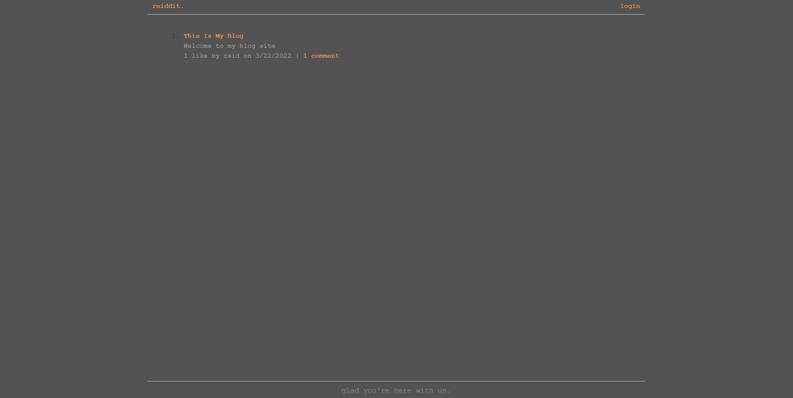

# reiddit

## Purpose
A full stack web application used as a blogging site where users can interact with one another on posts. 
Users can create, comment, and like posts on this site. 

## Built With
* JavaScript
* Sequelize
* Express
* SQL
* Dotenv
* Bcrypt
* Handlebars
* Session

## Deployed Application on Heroku
[Reiddit](https://cryptic-badlands-86498.herokuapp.com/)

## Examples

## Contribution
Reid Schroder